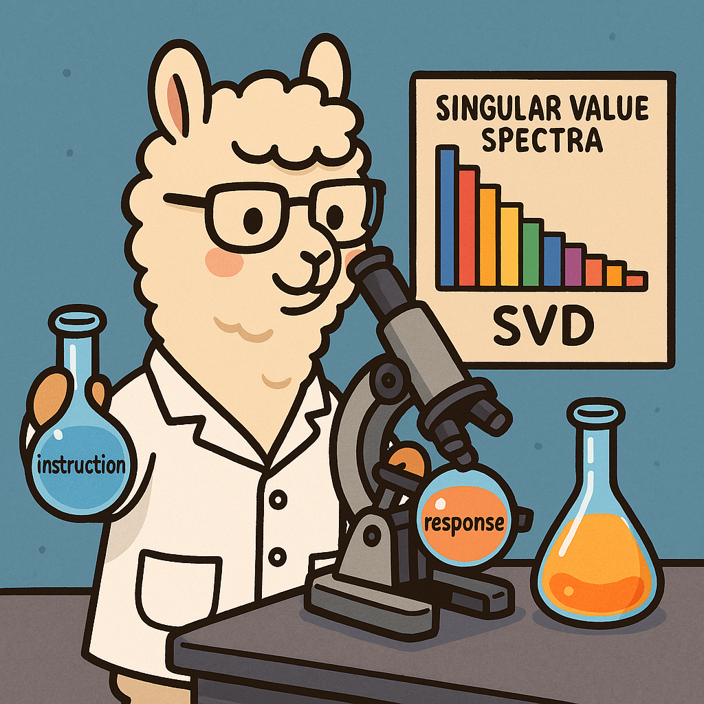

# How Instruction and Reasoning Data shape Post-Training: Data Quality through the Lens of Layer-wise Gradients

[How Instruction and Reasoning Data shape Post-Training: Data Quality through the Lens of Layer-wise Gradients](https://github.com/MingLiiii/Gradient_Unified) <br>
Chinese Version: [[知乎]](https://github.com/MingLiiii/Gradient_Unified)

This is the repo for the Gradient_Unified project, in which we provide a **Unified** view on the effects of data quality across instruction and reasoning data by spectural analysis.

<p align="center" width="40%">
<a ></a>
</p>

The repo contains:

- The code for Calculating Gradient Statistics.
- The code for Visualizing Gradient Statistics.
- The Gradient Statistics within our experimental scope.

(Feel free to email Ming ([Email](minglii@umd.edu)) for any questions or feedback.)

## News
- [2025/04] We released the Gradient_Unified paper!

## Contents
- [Overview](#overview)
- [Highlights](#highlights)
- [Install](#install)
- [Code for Gradients](#code-for-gradients)
- [Code for Quality Metrics](#code-for-quality-metrics)
- [ToDo](#todo)
- [Citation](#citation)

## Overview

As the post-training of large language models (LLMs) advances from instruction-following to complex reasoning tasks, understanding how different data affect finetuning dynamics remains largely unexplored. 
In this paper, we present a spectral analysis of layer-wise gradients induced by low/high-quality instruction and reasoning data for LLM post-training. 
Our analysis reveals that widely-studied metrics for data evaluation, e.g., IFD, InsTag, Difficulty, and Reward, can be explained and unified by spectral properties computed from gradients' singular value decomposition (SVD). Specifically, higher-quality data are usually associated with lower nuclear norms and higher effective ranks. 
Notably, effective rank exhibits better robustness and resolution than nuclear norm in capturing subtle quality differences. For example, reasoning data achieves substantially higher effective ranks than instruction data, implying richer gradient structures on more complex tasks.
Our experiments also highlight that models within the same family share similar gradient patterns regardless of their sizes, whereas different model families diverge significantly. 
Providing a unified view on the effects of data quality across instruction and reasoning data, 
this work illuminates the interplay between data quality and training stability, shedding novel insights into developing better data exploration strategies for post-training. 

## Highlights

**Our Key Findings:**
* Existing data quality metrics, e.g., IFD, InsTag, Difficulty, and Reward, can be **unified** due to consistent spectral properties of gradients, i.e., lower nuclear norms and higher effective ranks on high-quality data. This finding extends to both instruction and reasoning data, providing a unified view of the data quality effects.
* Effective rank outperforms nuclear norm to distinguish low- vs. high-quality data. For reasoning data, s1.1 data yields the largest effective ranks across all experiments, suggesting high correlations between reasoning complexity and gradient diversity.
* Within the same model family, layer-wise gradients' spectral properties remain consistent across different model sizes. In contrast, the gradient patterns diverge significantly across distinct model families, reflecting the unique learning dynamics of each model family.
* Cosine similarities between gradients from the same layer and adjacent layers remain nearly zero for different types of data, so they cannot reflect data quality.  

## Install

Install the dependencies with `pip install -r requirements.txt`

## Code for Gradients

### Calculating Gradient Statistics
```
data_names=(
wiz_10k_highest_200
wiz_10k_lowest_200
)
metric_names=(
ifd_gpt2
)
for i in $(seq 0 $((${#data_names[@]}-1))); do
    for j in $(seq 0 $((${#metric_names[@]}-1))); do

        # Get the chunk_len based on the current iteration
        data_name=${data_names[$i]}
        metric_name=${metric_names[$j]}

        python get_grad_vector_initial_try.py \
            --data_path _data/10k_version/${metric_name}/${data_name}.json \
            --save_path grads/qwen25_7b/${metric_name}/grads_${data_name}.jsonl \
            --model_name_or_path Qwen/Qwen2.5-7B \
            --max_length 4096
    done
done
```
**Note: The saved dict structure is shown in `dict_structure.txt` for better understanding.** 

### Visualizing Gradient Statistics

#### Nuclear Norm

```
python vis/try_vis_nuclear_two.py \
    --input1 "grads/${model_name}/${metric_name}/grads_${data_name}_highest_200.jsonl" \
    --input2 "grads/${model_name}/${metric_name}/grads_${data_name}_lowest_200.jsonl" \
    --output_path "grads/${model_name}/${metric_name}/vis_${data_name}_nuclear.png" \
    --main_title "Nuclear Norm (${data_name}) (${metric_name})" \
    --left_title "High (${metric_name})" \
    --right_title "Low (${metric_name})"
```

(For simplicity, we omit the loop on model/metric/data names.)

#### Effective Rank

```
python vis/try_vis_effective_rank_entropy_two.py \
    --input_path1 "grads/${model_name}/${metric_name}/grads_${data_name}_highest_200.jsonl" \
    --input_path2 "grads/${model_name}/${metric_name}/grads_${data_name}_lowest_200.jsonl" \
    --output_path "grads/${model_name}/${metric_name}/vis_${data_name}_effective_rank_entropy.png" \
    --figure_title1 "High (${metric_name})" \
    --figure_title2 "Low (${metric_name})"
```

#### Same-layer Similarity 

```
python vis/try_vis_cosine_qkvo_two.py \
    --input1 "grads/${model_name}/${metric_name}/grads_${data_name}_highest_200.jsonl" \
    --input2 "grads/${model_name}/${metric_name}/grads_${data_name}_lowest_200.jsonl" \
    --output  "grads/${model_name}/${metric_name}/vis_${data_name}_cosine_qkvo.png" \
    --title1    "High (${metric_name})" \
    --title2    "Low (${metric_name})"
```

#### Adjacent-layer Similarity

```
python vis/try_vis_cosine_two.py \
    --data_path1 "grads/${model_name}/${metric_name}/grads_${data_name}_highest_200.jsonl" \
    --data_path2 "grads/${model_name}/${metric_name}/grads_${data_name}_lowest_200.jsonl" \
    --save_fig  "grads/${model_name}/${metric_name}/vis_${data_name}_cosine_adj.png" \
    --title1    "High (${metric_name})" \
    --title2    "Low (${metric_name})"
```

## Code for Quality Metrics

### IFD

### InsTag

### Reward

### Difficulty

## ToDo
- [x] Release paper and codes. 
- [ ] Release the gradient statistics.

## Citation

Please consider citing our papers if you think our code or data are useful. Thank you! <br>
```
```
